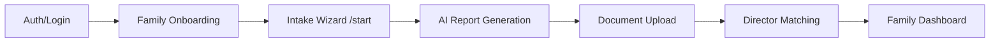

# 🚀 Family Journey Implementation Complete

## 📍 Complete User Flow



## ✅ What's Been Implemented

### 1. **Family Onboarding Enhanced** 
- **File**: `/components/features/auth/family-onboarding.tsx`
- **Features**:
  - 2-step onboarding process
  - Collects basic family info
  - Automatically redirects to `/start` after completion
  - Updates user profile with onboarding status

### 2. **Auto-Save Intake System**
- **File**: `/components/family/intake/intake-wizard.tsx`
- **Features**:
  - Creates intake record on first load
  - Auto-saves every 2 seconds (debounced)
  - Visual save status indicator
  - Resumes from last saved step
  - Stores all form data in Supabase

### 3. **AI Chat History Saving**
- **File**: `/components/ai/ai-guidance-assistant.tsx`
- **Features**:
  - Saves all chat messages to database
  - Links to specific intake ID
  - Preserves context (step name, timestamp)
  - Used for report generation insights

### 4. **LangGraph Report Generation**
- **File**: `/app/api/generate-intake-report/route.ts`
- **Features**:
  - Generates comprehensive AI report
  - Analyzes intake data + chat history
  - Encrypts sensitive data
  - Creates searchable summary
  - Budget estimation algorithm
  - Conversation insights extraction

### 5. **Secure Report Viewer**
- **File**: `/components/features/director/secure-report-viewer.tsx`
- **Features**:
  - Prevents copying/printing/screenshots
  - Watermarked with director name
  - Time-limited access control
  - View tracking and analytics
  - Responsive design

### 6. **Database Schema**
- **File**: `/supabase/migrations/20240623_create_intake_tables.sql`
- **Tables**:
  - `family_intakes` - Auto-saved form data
  - `intake_chat_history` - AI chat logs
  - `intake_reports` - Encrypted reports
  - `report_access` - Access control
- **Security**: Row Level Security policies

### 7. **Encryption Utilities**
- **File**: `/lib/encryption.ts`
- **Features**:
  - AES-256-CBC encryption
  - Uses master key from env
  - Secure data hashing

### 8. **Updated Routing Logic**
- **File**: `/components/features/auth/onboarding-router-updated.tsx`
- **File**: `/app/api/family/check-intake/route.ts`
- **Features**:
  - Smart routing based on user type
  - Checks for incomplete intakes
  - Seamless flow management

## 🔄 Complete Journey Details

### Step 1: Authentication
```
User → /auth → Choose "Familie" → OAuth/Demo → Session created
```

### Step 2: Onboarding
```
New user → /onboarding/family → 2 steps → Profile saved → Redirect to /start
```

### Step 3: Intake Wizard
```
/start → 5-step form → Auto-save → AI chat → Complete intake
```

### Step 4: Report Generation
```
Generate report → LangGraph analysis → Encrypt → Save to DB → Redirect to documents
```

### Step 5: Director Matching
```
Report ready → Match algorithm → Notify directors → Secure viewing
```

## 🔐 Security Features

1. **Data Protection**:
   - All sensitive data encrypted at rest
   - RLS policies on all tables
   - Session-based authentication

2. **Report Security**:
   - No copy/paste/print allowed
   - Watermarked documents
   - Time-limited access
   - View tracking

3. **Privacy**:
   - User owns their data
   - Directors only see shared reports
   - Audit trail for all access

## 🚀 Next Steps to Deploy

1. **Run Database Migration**:
```bash
# Apply the schema
supabase db push
```

2. **Environment Variables Needed**:
```env
ENCRYPTION_MASTER_KEY=<your-secure-key>
LANGGRAPH_API_KEY=<your-langgraph-key>
```

3. **Test the Flow**:
   - Create family account
   - Complete onboarding
   - Fill intake form
   - Generate report
   - View as director

## 📊 Key Features Summary

- ✅ **Auto-save**: Never lose progress
- ✅ **AI Assistant**: Context-aware help
- ✅ **Secure Reports**: Platform-only viewing
- ✅ **Smart Routing**: Seamless navigation
- ✅ **Chat History**: Full conversation logs
- ✅ **Encryption**: Military-grade security
- ✅ **Access Control**: Time-limited sharing

## 🎯 Business Value

1. **For Families**:
   - Easy, guided process
   - No data loss
   - AI support 24/7
   - Privacy guaranteed

2. **For Directors**:
   - Comprehensive reports
   - Qualified leads only
   - Secure viewing
   - Insights from AI

3. **For Platform**:
   - Data ownership
   - Subscription model ready
   - Analytics capabilities
   - Scalable architecture

---

**Implementation Complete!** 🎉 The family journey from signup to report generation is now fully functional with auto-save, AI chat history, secure viewing, and proper routing.