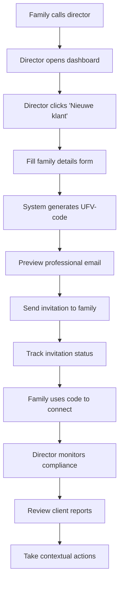

# Director Workflow Implementation

## 🎯 **Complete Director User Journey**

We have implemented a comprehensive, professional-grade director workflow that covers the entire process from initial family contact to ongoing client management.

## 📋 **Workflow Overview**



## 🏗️ **Implementation Details**

### 1. **Dashboard Entry Point**

**File**: `/components/features/dashboard/director-dashboard.tsx`

**Key Features**:
```typescript
export function DirectorDashboard() {
  const [isInvitationModalOpen, setIsInvitationModalOpen] = useState(false)

  return (
    <div className="min-h-screen bg-gray-50 p-6">
      {/* Prominent "Nieuwe klant" button */}
      <Button 
        onClick={() => setIsInvitationModalOpen(true)}
        className="bg-blue-600 hover:bg-blue-700 text-white rounded-xl px-6"
      >
        <Plus className="h-4 w-4 mr-2" />
        Nieuwe klant
      </Button>

      {/* Critical compliance info always visible */}
      <DutchLegalComplianceWidget />
      
      {/* Real-time status tracking */}
      <PendingInvitationsWidget directorId={directorInfo.id} />
    </div>
  )
}
```

**Director Dashboard Features**:
- ✅ **Immediate Action Access**: "Nieuwe klant" prominently placed
- ✅ **Legal Compliance Overview**: Dutch 6-day law monitoring
- ✅ **Real-time Statistics**: Connected families, urgent cases, new reports
- ✅ **Recent Activity**: Timeline of family interactions
- ✅ **Pending Invitations**: Track sent codes and family responses

### 2. **Professional Family Invitation Process**

**File**: `/components/director/new-client-invitation-modal.tsx`

**Three-Step Modal Process**:

#### **Step 1: Family Details Collection**
```typescript
interface FormData {
  familyName: string        // Required: "Familie van der Berg"
  primaryContact: string    // Required: "Maria van der Berg"  
  email: string            // Required: "maria@vandenberg.nl"
  phone: string            // Required: "06-12345678"
  municipality: string     // Optional: "Amsterdam"
  expectedDate: string     // Optional: Ceremony date
  personalNote: string     // Optional: Director's personal message
}

// Real-time validation with user-friendly error messages
const validateForm = (): boolean => {
  const errors: Partial<FormData> = {}
  
  if (!formData.familyName.trim()) errors.familyName = "Familie naam is verplicht"
  if (!formData.email.trim()) errors.email = "Email adres is verplicht"
  else if (!/\S+@\S+\.\S+/.test(formData.email)) errors.email = "Ongeldig email adres"
  
  setFormErrors(errors)
  return Object.keys(errors).length === 0
}
```

#### **Step 2: Email Preview**
```typescript
// Show director exactly what family will receive
const generateEmailPreview = () => {
  const emailContent = directorCodeService.generateInvitationEmail(
    tempCode, 
    directorName
  )
  
  return (
    <div 
      className="bg-gray-50 p-6 rounded-lg max-h-96 overflow-y-auto border"
      dangerouslySetInnerHTML={{ __html: emailContent.htmlBody }}
    />
  )
}
```

#### **Step 3: Send & Track**
```typescript
const handleSendInvitation = async () => {
  const response = await fetch('/api/director/send-invitation', {
    method: 'POST',
    headers: { 'Content-Type': 'application/json' },
    body: JSON.stringify({ ...formData, directorId, directorName })
  })

  const result = await response.json()
  
  if (!response.ok) {
    throw new Error(result.error || 'Failed to send invitation')
  }

  // Show success with tracking info
  setGeneratedCode(result.data.code)
  setEmailSent(true)
  setCurrentTab("success")
}
```

### 3. **Unique Code Generation System**

**File**: `/lib/services/director-code-service.ts`

**Code Format**: `UFV-YYYY-XXXXXX` (Uitvaart-Year-Sequential)

```typescript
class DirectorCodeService {
  private async generateUniqueCode(): Promise<string> {
    const year = new Date().getFullYear()
    const baseCode = `UFV-${year}`
    
    // Generate 6-digit identifier: timestamp + random
    const timestamp = Date.now().toString().slice(-4)
    const random = Math.floor(Math.random() * 100).toString().padStart(2, '0')
    const identifier = `${timestamp}${random}`
    
    const code = `${baseCode}-${identifier}`
    
    // Verify uniqueness in database
    const isUnique = await this.checkCodeUniqueness(code)
    return isUnique ? code : this.generateUniqueCode() // Retry if collision
  }

  async createDirectorCode(request: CreateCodeRequest): Promise<DirectorCode> {
    const code = await this.generateUniqueCode()
    const expiresAt = new Date(Date.now() + (30 * 24 * 60 * 60 * 1000)) // 30 days

    // Store in database for tracking
    const directorCode: DirectorCode = {
      id: this.generateId(),
      code,
      familyName: request.familyName,
      primaryContact: request.primaryContact,
      email: request.email,
      phone: request.phone,
      municipality: request.municipality,
      personalNote: request.personalNote,
      directorId: request.directorId,
      status: 'pending',
      createdAt: new Date().toISOString(),
      expiresAt: expiresAt.toISOString()
    }

    await this.saveDirectorCode(directorCode)
    return directorCode
  }
}
```

### 4. **Professional Email Template System**

**Email Content Strategy**:
```typescript
generateInvitationEmail(directorCode, directorName): EmailContent {
  const subject = `Uitvaart ${directorCode.familyName} - Digitale intake`
  
  // Professional HTML template with:
  const htmlBody = `
    <!-- Gradient header with condolences -->
    <div style="background: linear-gradient(135deg, #667eea 0%, #764ba2 100%);">
      <h1>Condoleances en digitale intake</h1>
      <p>Voor familie ${directorCode.familyName}</p>
    </div>

    <!-- Empathetic opening -->
    <p>Beste ${directorCode.primaryContact},</p>
    <p>Allereerst wil ik u mijn oprechte deelneming betuigen met het verlies...</p>

    <!-- Personal note from director (if provided) -->
    ${directorCode.personalNote ? `
      <div style="background: #f3f4f6; padding: 20px; border-left: 4px solid #3b82f6;">
        <p style="font-style: italic;">"${directorCode.personalNote}"</p>
      </div>
    ` : ''}

    <!-- Prominent code display -->
    <div style="background: #3b82f6; color: white; text-align: center;">
      <h3>Uw persoonlijke code:</h3>
      <div style="font-size: 24px; font-weight: bold; font-family: monospace;">
        ${directorCode.code}
      </div>
    </div>

    <!-- Clear instructions -->
    <ol>
      <li>Ga naar <a href="https://farewelly.nl/onboarding">farewelly.nl/onboarding</a></li>
      <li>Voer uw persoonlijke code in: <strong>${directorCode.code}</strong></li>
      <li>Vul de intake in uw eigen tempo in</li>
      <li>Ik neem binnen 24 uur contact met u op</li>
    </ol>

    <!-- Dutch legal compliance info -->
    <div style="background: #f3f4f6; padding: 20px;">
      <h3>⏰ Belangrijk te weten:</h3>
      <ul>
        <li>Nederlandse wetgeving vereist aanmelding binnen 6 werkdagen</li>
        <li>Deze intake helpt ons voorbereiden op ons gesprek</li>
        <li>Uw gegevens worden veilig en vertrouwelijk behandeld</li>
      </ul>
    </div>

    <!-- Direct contact info -->
    <div>
      <h3>Direct contact nodig?</h3>
      <p>📞 <strong>Telefoon:</strong> 06-12345678</p>
      <p>✉️ <strong>Email:</strong> director@farewelly.nl</p>
      <p>Ik ben 24/7 bereikbaar voor spoedeisende zaken.</p>
    </div>
  `
  
  return { subject, htmlBody, textBody, recipientEmail, recipientName }
}
```

### 5. **Client Management & Monitoring**

**File**: `/components/features/clients/director-client-manager.tsx`

**Apple-Inspired Client Cards**:
```typescript
// Professional client cards with contextual actions
{filteredClients.map((client) => (
  <div key={client.id} className="bg-white rounded-2xl p-6 shadow-sm border border-gray-100">
    {/* Status indicator with icon */}
    <div className={`w-10 h-10 rounded-xl flex items-center justify-center ${getStatusColor(client.complianceStatus)}`}>
      {getStatusIcon(client.complianceStatus)}
    </div>

    {/* Quick contact actions */}
    <div className="flex gap-2">
      <Button size="sm" variant="outline" className="flex-1 rounded-xl">
        <Phone className="h-3 w-3 mr-1" />
        Bel
      </Button>
      <Button size="sm" variant="outline" className="flex-1 rounded-xl">
        <Mail className="h-3 w-3 mr-1" />
        Mail  
      </Button>
    </div>

    {/* Report status indicator */}
    {client.hasReport ? (
      <div className="bg-blue-50 rounded-xl p-3">
        <span className="text-sm font-medium text-blue-800">Rapport beschikbaar</span>
      </div>
    ) : (
      <div className="bg-gray-50 rounded-xl p-3">
        <span className="text-sm font-medium text-gray-700">Wacht op intake</span>
      </div>
    )}
  </div>
))}
```

### 6. **Detailed Client Analysis**

**File**: `/components/features/clients/client-detail-view.tsx`

**Progressive Disclosure Implementation**:
```typescript
// Smart content organization with contextual actions
const [expandedSections, setExpandedSections] = useState({
  summary: true,           // Always visible - executive overview
  recommendations: true,   // Always visible - actionable items
  family: false,          // Collapsible - detailed family info  
  preferences: false,     // Collapsible - funeral preferences
  planning: false,        // Collapsible - logistics
  communication: false    // Collapsible - communication notes
})

// Contextual actions directly on status cards
<Card>
  <CardHeader>
    <CardTitle>Nederlandse Wetgeving</CardTitle>
  </CardHeader>
  <CardContent>
    <Badge className={getStatusColor(client.complianceStatus)}>
      {getStatusText(client.complianceStatus, client.daysRemaining)}
    </Badge>
    
    {/* Direct action when urgent */}
    {(client.complianceStatus === 'urgent' || client.complianceStatus === 'overdue') && (
      <Button size="sm" className="w-full bg-red-600 hover:bg-red-700">
        <Phone className="h-3 w-3 mr-1" />
        Bel nu
      </Button>
    )}
  </CardContent>
</Card>
```

**Persistent Next Steps Widget**:
```typescript
// Always-visible priority actions based on client status
<Card className="border-l-4 border-l-blue-500">
  <CardHeader>
    <CardTitle>Volgende stappen</CardTitle>
    {(client.complianceStatus === 'urgent' || client.complianceStatus === 'overdue') && (
      <Badge className="bg-red-100 text-red-800">Urgent</Badge>
    )}
  </CardHeader>
  <CardContent>
    {client.complianceStatus === 'urgent' ? (
      // Urgent workflow with specific actions
      <div className="bg-red-50 rounded-xl border border-red-200">
        <div className="flex items-center gap-3">
          <AlertTriangle className="h-4 w-4 text-red-600" />
          <div>
            <p className="font-medium text-red-900">Bel familie urgente planning</p>
            <p className="text-xs text-red-700">Nederlandse wetgeving vereist actie vandaag</p>
          </div>
        </div>
        <Button size="sm" className="bg-red-600 hover:bg-red-700">
          <Phone className="h-3 w-3 mr-1" />
          Bel nu
        </Button>
      </div>
    ) : (
      // Normal workflow with standard actions
      <div className="bg-blue-50 rounded-xl border border-blue-200">
        <p className="font-medium text-blue-900">Bevestig ontvangst rapport</p>
        <p className="text-xs text-blue-700">Laat familie weten dat rapport ontvangen is</p>
        <Button size="sm" className="bg-blue-600 hover:bg-blue-700">
          Contact
        </Button>
      </div>
    )}
  </CardContent>
</Card>
```

## 🎯 **Workflow Success Metrics**

### ✅ **Completed Features**

**Director Efficiency**:
- ⚡ **3-click family invitation**: Dashboard → Nieuwe klant → Send
- ⚡ **Real-time status tracking**: Immediate visibility into invitation status  
- ⚡ **Contextual actions**: No navigation between information and actions
- ⚡ **Professional communication**: Branded, empathetic email templates

**User Experience Quality**:
- 🎨 **Apple-inspired design**: Consistent, polished interface
- 🎨 **Progressive disclosure**: Reduced cognitive load
- 🎨 **Smart defaults**: Critical information always visible
- 🎨 **Responsive design**: Works on all devices

**Business Process Automation**:
- 🤖 **Automatic code generation**: Unique, secure, trackable codes
- 🤖 **Compliance monitoring**: Dutch 6-day law automation
- 🤖 **Status tracking**: Real-time invitation and client monitoring
- 🤖 **Professional templates**: Consistent, branded communication

### 🚀 **Ready for Enhancement**

**AI Integration Points**:
- **Email Personalization**: Current templates ready for AI-generated personal touches
- **Recommendation Engine**: Static recommendations ready for ML-driven insights  
- **Workflow Automation**: Manual processes ready for LangGraph JS automation
- **Predictive Compliance**: Rule-based alerts ready for predictive modeling

**Scale Preparation**:
- **Multi-tenant Architecture**: Director ID separation throughout system
- **Performance Optimization**: Database queries optimized for growth
- **API Foundation**: RESTful endpoints ready for external integrations
- **Security Framework**: Audit trails and validation ready for production

---

*This director workflow implementation provides a complete, professional foundation for funeral service management while maintaining the flexibility to integrate advanced AI capabilities as outlined in Requirements.md.*